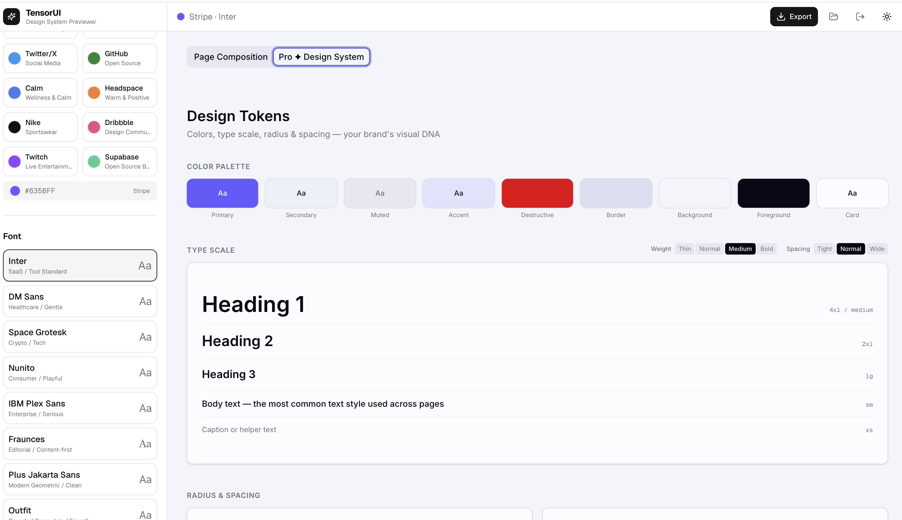
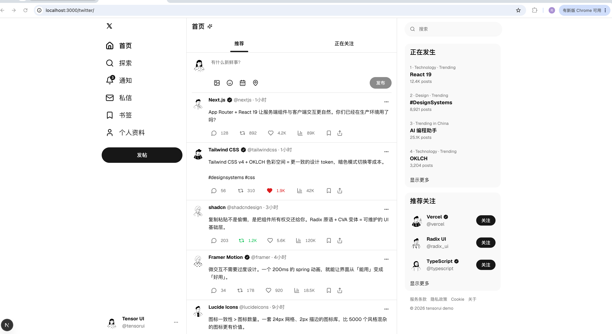
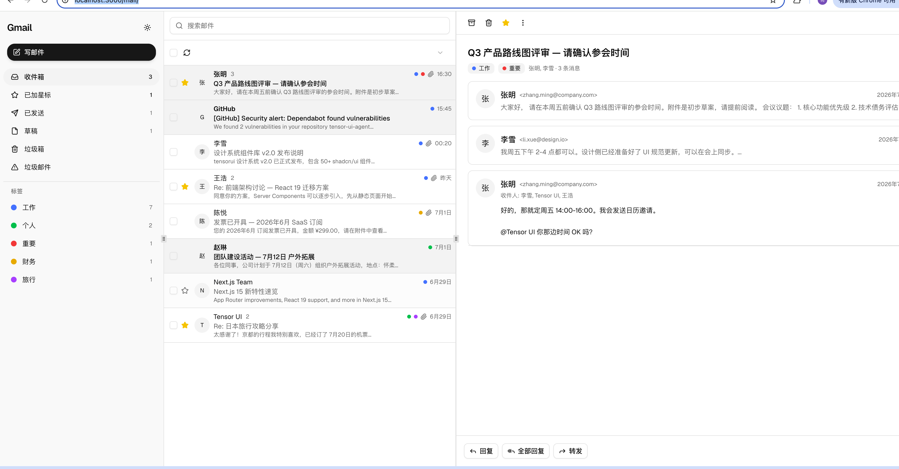
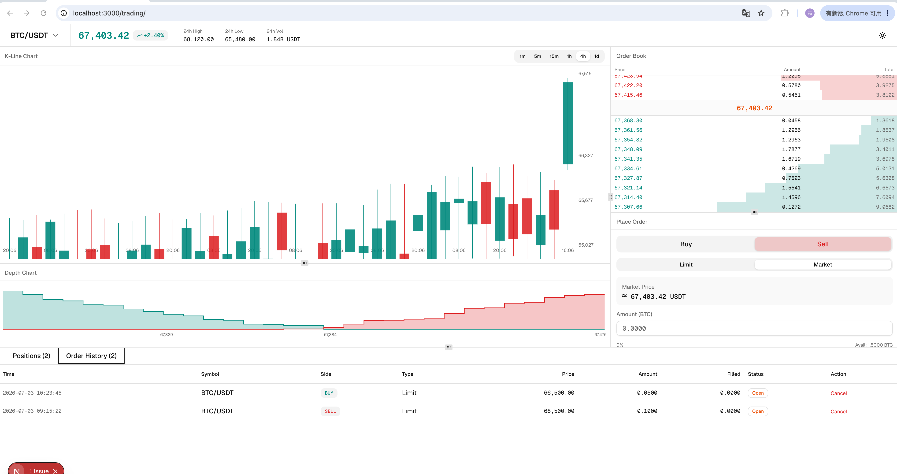

<div align="center">

# TensorUI CLI

**Lovable for your terminal — AI page generation with design system constraints**

[English](#english) · [中文](#中文)

[](https://www.npmjs.com/package/@tensorzhang/tensorui)
[](LICENSE)

</div>

---

<a id="english"></a>

## What is TensorUI CLI?

TensorUI CLI is the **CLI version of [Lovable](https://lovable.dev)** — an AI-powered terminal tool that generates full UI pages under your design system constraints. Unlike generic AI code generators, TensorUI ensures every page follows your brand colors, typography, spacing rules, and component API.

It uses the [Claude Agent SDK](https://github.com/anthropics/claude-code) under the hood and integrates with an MCP (Model Context Protocol) design system server, so the AI always generates code that matches your design system — not random styles.

### Features

- **Design-constrained generation** — AI follows your design rules, not generic patterns
- **MCP design system server** — brand colors, typography, spacing, and component specs are injected via MCP tools
- **Session resume** — pick up where you left off with `--continue` or `--resume <id>`
- **Provider-agnostic** — works with Anthropic, DeepSeek, or any Anthropic-compatible API
- **Interactive terminal UI** — built with [Ink](https://github.com/vadimdemedes/ink) for a smooth CLI experience

### Quick Start

#### Step 1: Create your design system on TensorUI Studio

Visit **[tensorui.cn](http://www.tensorui.cn/)** to create and customize your design system:

- Choose brand colors, typography, and spacing
- Preview components in real-time
- Click **"Export Design System"** to save it to your project library



#### Step 2: Install and configure the CLI

```bash
# Install globally
npm install -g @tensorzhang/tensorui

# Set up your API key
cp .env.example .env
# Edit .env and add your ANTHROPIC_API_KEY
```

#### Step 3: Clone your design system and start generating

```bash
# Start the CLI in your project directory
tensorui

# Clone your design system (copy the URL from your project library on tensorui.cn)
/clone https://tensorui.cn/api/projects/xxx/download

# Now just type naturally
❯ Create a pricing page with 3-column comparison
❯ Add a hero section with gradient background
❯ Add a dashboard with user growth chart
```

### Gallery — Generated with Haiku

These pages were generated using Claude Haiku (the fastest and cheapest model) with TensorUI design system constraints:

| Twitter/X Clone | Gmail Clone | Crypto Trading Platform |
|:---:|:---:|:---:|
|  |  |  |

> Even with the smallest model, TensorUI generates production-quality pages that follow your design system.

### Configuration

Create a `.env` file in the same directory as the CLI (or the project directory):

```env
# Required
ANTHROPIC_API_KEY=sk-ant-api03-...

# Optional
ANTHROPIC_BASE_URL=https://api.anthropic.com
ANTHROPIC_MODEL=claude-sonnet-4-20250514
```

You can also pass options via CLI flags:

```bash
tensorui --api-key sk-ant-... --model claude-sonnet-4-20250514
tensorui --continue          # Resume last session
tensorui --resume <id>       # Resume specific session
```

### Commands

| Command | Description |
|---------|-------------|
| `/clone <url>` | Clone a design system from a URL |
| `/model [name]` | Show or switch the current model |
| `/config [key val]` | View or update configuration |
| `/resume` | List and select a recent session |
| `/help` | Show help message |

### How It Works

```
tensorui.cn (Studio)          CLI (Terminal)
┌──────────────────┐          ┌──────────────────┐
│ 1. Define brand  │          │ 3. /clone <url>  │
│    colors, fonts,│  Export  │    ↓              │
│    spacing rules │ ──────→  │ 4. Type naturally │
│ 2. Export design │          │    AI generates   │
│    system        │          │    pages following│
│                  │          │    your design    │
└──────────────────┘          └──────────────────┘
```

---

<a id="中文"></a>

## TensorUI CLI 是什么？

TensorUI CLI 是 **[Lovable](https://lovable.dev) 的 CLI 版本** — 一个 AI 驱动的终端工具，在你的设计系统约束下生成完整的 UI 页面。与通用 AI 代码生成器不同，TensorUI 确保每个页面都遵循你的品牌色彩、字体排版、间距规则和组件 API。

底层使用 [Claude Agent SDK](https://github.com/anthropics/claude-code)，并集成了 MCP（模型上下文协议）设计系统服务器 — AI 始终生成符合你设计系统的代码，而非随机样式。

### 特性

- **设计约束生成** — AI 遵循你的设计规则，而非通用模式
- **MCP 设计系统服务器** — 品牌色、字体、间距和组件规范通过 MCP 工具注入
- **会话恢复** — 使用 `--continue` 或 `--resume <id>` 继续上次的工作
- **多供应商支持** — 兼容 Anthropic、DeepSeek 或任何 Anthropic 兼容 API
- **交互式终端界面** — 基于 [Ink](https://github.com/vadimdemedes/ink) 构建

### 快速开始

#### 第一步：在 TensorUI Studio 上创建你的设计系统

访问 **[tensorui.cn](http://www.tensorui.cn/)** 创建和自定义你的设计系统：

- 选择品牌色、字体和间距
- 实时预览组件效果
- 点击 **「导出设计系统」** 保存到项目库


#### 第二步：安装并配置 CLI

```bash
# 全局安装
npm install -g @tensorzhang/tensorui

# 配置 API 密钥
cp .env.example .env
# 编辑 .env，填入你的 ANTHROPIC_API_KEY
```

#### 第三步：克隆设计系统并开始生成

```bash
# 在项目目录启动 CLI
tensorui

# 克隆你的设计系统（从 tensorui.cn 项目库复制 URL）
/clone https://tensorui.cn/api/projects/xxx/download

# 用自然语言描述你想要的页面
❯ 创建一个定价页面，三栏对比
❯ 添加一个带渐变背景的 Hero 区域
❯ 给 dashboard 加一个用户增长折线图
```

### 作品展示 — Haiku 模型生成

以下页面均使用 Claude Haiku（最快最便宜的模型）在 TensorUI 设计系统约束下生成：

| Twitter/X 克隆 | Gmail 克隆 | 加密货币交易平台 |
|:---:|:---:|:---:|
|  |  |  |

> 即使使用最小的模型，TensorUI 也能生成遵循设计系统的生产级页面。

### 配置

在 CLI 所在目录或项目目录创建 `.env` 文件：

```env
# 必填
ANTHROPIC_API_KEY=sk-ant-api03-...

# 选填
ANTHROPIC_BASE_URL=https://api.anthropic.com
ANTHROPIC_MODEL=claude-sonnet-4-20250514
```

也可以通过命令行参数传入：

```bash
tensorui --api-key sk-ant-... --model claude-sonnet-4-20250514
tensorui --continue          # 恢复上次会话
tensorui --resume <id>       # 恢复指定会话
```

### 命令

| 命令 | 说明 |
|------|------|
| `/clone <url>` | 从 URL 克隆设计系统 |
| `/model [name]` | 查看或切换当前模型 |
| `/config [key val]` | 查看或更新配置 |
| `/resume` | 列出并选择最近的会话 |
| `/help` | 显示帮助信息 |

### 工作流程

```
tensorui.cn (Studio)          CLI (终端)
┌──────────────────┐          ┌──────────────────┐
│ 1. 定义品牌色、  │          │ 3. /clone <url>  │
│    字体、间距    │  导出    │    ↓              │
│ 2. 导出设计系统  │ ──────→  │ 4. 输入自然语言   │
│                  │          │    AI 按设计系统   │
│                  │          │    生成页面        │
└──────────────────┘          └──────────────────┘
```

---

## Community / 社区

- [Telegram](https://t.me/tensorui)
- [Discord](https://discord.gg/tensorui)
- [X (Twitter)](https://x.com/tensorui)

## License / 许可证

[MIT](LICENSE)
